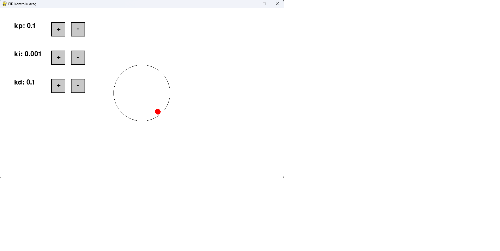

# PID Kontrollü Araç Simülasyonu

Bu Python programı, PID denetleyici kullanarak bir aracı belirli bir hedefe doğru hareket ettiren basit bir simülasyonu gösterir. Program, Pygame kütüphanesi kullanılarak oluşturulmuştur.

## Kullanım

1. **Kontrol Parametrelerini Ayarlama:**
   - Kp, Ki ve Kd parametrelerini artırmak veya azaltmak için ilgili "+" ve "-" butonlarına tıklayın.
   - Kp: P (Proportional) terim katsayısı
   - Ki: I (Integral) terim katsayısı
   - Kd: D (Derivative) terim katsayısı

2. **Aracın Hareketi:**
   - PID denetleyici, aracın hedefe olan konumundaki hatayı hesaplar ve aracın hareketini buna göre ayarlar.

3. **Araba Görüntüsü:**
   - Araba, simülasyon boyunca sabit bir yarıçapa sahip bir daire yerine bir görüntü olarak temsil edilir. 

## Kurulum

1. Python'u [resmi web sitesinden](https://www.python.org/downloads/) indirip kurun.
2. Projeyi bilgisayarınıza klonlayın veya ZIP dosyası olarak indirin.
3. Gereksinimleri yüklemek için terminalde veya komut istemcisinde şu komutu çalıştırın:
4. `PyGamePID.py` dosyasını çalıştırarak programı başlatın.

## Örnek Görüntü

## Katkılar

Bu proje her türlü katkıya açıktır. Herhangi bir hata bulursanız veya bir öneriniz varsa lütfen bir konu açın veya bir çekme isteği gönderin.

## Lisans

Bu proje MIT lisansı altında lisanslanmıştır. Daha fazla bilgi için `LICENSE` dosyasına bakın.